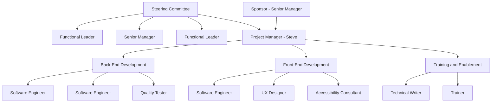

# 📱 Project+ Demo – ChatBot Mobile App Project

## 1️⃣ Project Overview

**Project Name:** ChatBot Mobile App
**Objective:**
Design, build, test, and deploy a mobile chatbot application that supports basic customer interaction using AI/NLP.

**Project Manager:** Steve (Instructor / PM)

---

## 2️⃣ Project Organization Chart

### Organizational Structure

```text
Project Manager (PM)
│
├── Business & Requirements
│   ├── Business Analyst (BA)
│   └── Stakeholder Liaison
│
├── Technical Development
│   ├── Solution Architect
│   ├── Mobile App Developer
│   └── AI / Chatbot Engineer
│
├── Quality & Testing
│   └── QA / Test Lead
│
└── Operations & Support
    ├── DevOps / Deployment Engineer
    └── Documentation & Training Lead
```

### Example Org Chart



---

## 3️⃣ Role Assignment (Students)

| No | Name                              | Assigned Role                 |
| -- | --------------------------------- | ----------------------------- |
| PM | **Steve**                         | Project Manager               |
| 1  | Nur Aisya Najihah Binti Roslan    | Business Analyst              |
| 2  | Mohd Syafi’i Bin Mazlan           | Solution Architect            |
| 3  | Asrul Raiffuddeen Bin Allauddin   | Mobile App Developer          |
| 4  | Muhammad Syafiq Bin Mohd Hadzrami | AI / Chatbot Engineer         |
| 5  | Shazrin Afiqah Mohd Sharizan      | QA / Test Lead                |
| 6  | Hajar Mardhiah Binti Aifin        | DevOps / Deployment Engineer  |
| 7  | Syafiqah Binti Ainuddeen          | Documentation & Training Lead |
| 8  | Nor Amila Aina Binti Abdul Manap  | Stakeholder Liaison           |


---

## 4️⃣ RACI Matrix (Responsibility Assignment Matrix)

**Legend:**

* **R** = Responsible
* **A** = Accountable
* **C** = Consulted
* **I** = Informed

| Project Activity          | PM | BA | SA | Dev | AI | QA | DevOps | Doc | Stake |
| ------------------------- | -- | -- | -- | --- | -- | -- | ------ | --- | ----- |
| Project Planning          | A  | R  | C  | I   | I  | I  | I      | I   | C     |
| Requirements Gathering    | A  | R  | C  | I   | I  | I  | I      | I   | C     |
| System Architecture       | A  | C  | R  | C   | C  | I  | I      | I   | I     |
| Mobile App Development    | A  | I  | C  | R   | C  | I  | I      | I   | I     |
| Chatbot AI Development    | A  | I  | C  | C   | R  | I  | I      | I   | I     |
| Testing & QA              | A  | I  | I  | C   | C  | R  | I      | I   | I     |
| Deployment                | A  | I  | I  | I   | I  | C  | R      | I   | I     |
| Documentation             | A  | I  | I  | I   | I  | I  | I      | R   | I     |
| Stakeholder Communication | A  | I  | I  | I   | I  | I  | I      | I   | R     |


---

## 5️⃣ RAM Matrix (Responsibility Assignment Matrix – Role vs Work Package)

This version is **task-oriented**, simpler, and very Project+ friendly.

| Work Package                 | Assigned Role         |
| ---------------------------- | --------------------- |
| Project Management & Control | Project Manager       |
| Business Requirements        | Business Analyst      |
| System & App Architecture    | Solution Architect    |
| Mobile App Development       | Mobile App Developer  |
| Chatbot Logic & AI           | AI / Chatbot Engineer |
| Testing & Validation         | QA / Test Lead        |
| CI/CD & Deployment           | DevOps Engineer       |
| User Guide & Training        | Documentation Lead    |
| Client Communication         | Stakeholder Liaison   |

---


## User Login Mapping

* login url:  https://project.apps.ocp4.cognitoz.org/ 

| No | Student Name | OpenProject Login |
|---|---|---|
| 1 | Nur Aisya Najihah Binti Roslan | stu01@cognitoz.org |
| 2 | Mohd Syafi’i Bin Mazlan | stu02@cognitoz.org |
| 3 | Asrul Raiffuddeen Bin Allauddin | stu03@cognitoz.org |
| 4 | Muhammad Syafiq Bin Mohd Hadzrami | stu04@cognitoz.org |
| 5 | Shazrin Afiqah Mohd Sharizan | stu05@cognitoz.org |
| 6 | Hajar Mardhiah Binti Aifin | stu06@cognitoz.org |
| 7 | Syafiqah Binti Ainuddeen | stu07@cognitoz.org |
| 8 | Nor Amila Aina Binti Abdul Manap | stu08@cognitoz.org |

---